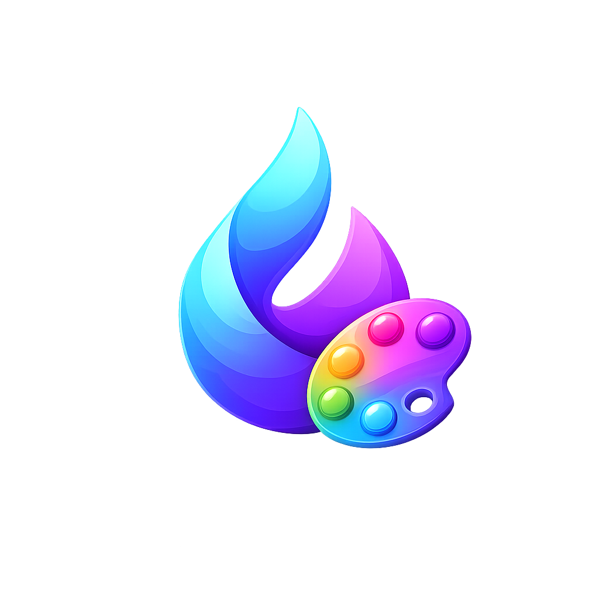
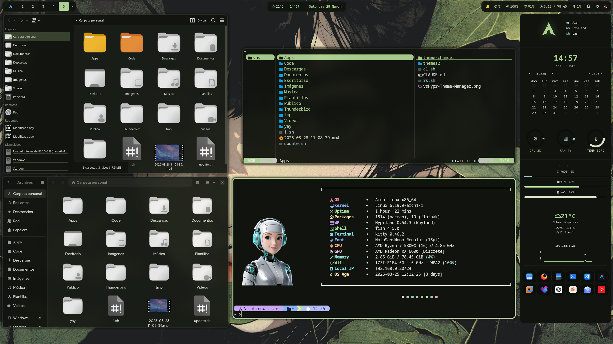
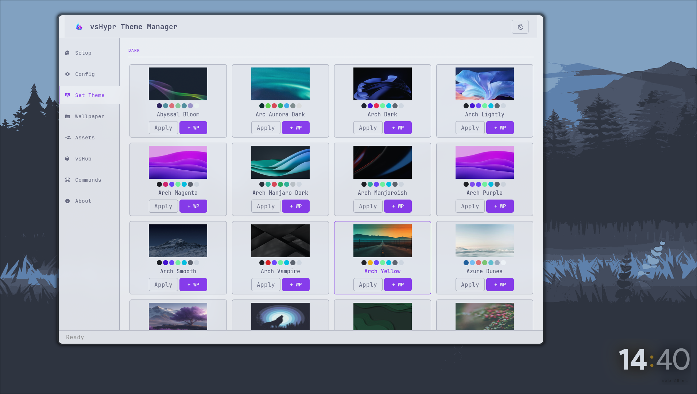
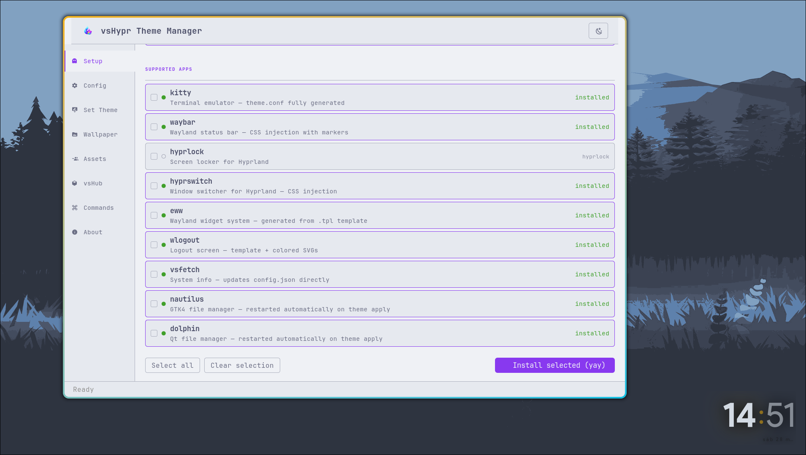
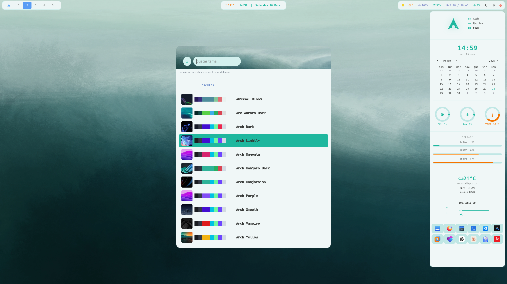
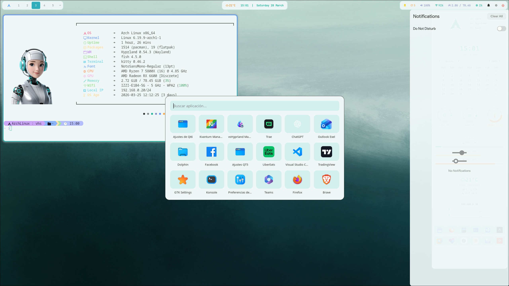

<p align="center">
  
</p>

<h1 align="center">vsHypr Theme Manager</h1>

<p align="center">
  A complete theming system for <strong>Arch Linux + Hyprland</strong>.<br>
  One command. Every app. Consistent colors everywhere.
</p>

<p align="center">
  
</p>

---

## What it does

vsHypr Theme Manager applies a unified color scheme across your entire desktop in a single action — terminal, bar, notifications, lock screen, window manager, file manager, widgets, and every Qt/GTK application. It injects colors non-destructively, keeping your existing configuration intact, and backs up every file before touching it.

---

## Screenshots

<table>
  <tr>
    <td></td>
    <td></td>
  </tr>
  <tr>
    <td align="center"><em>Set Theme — visual grid with thumbnails & color palettes</em></td>
    <td align="center"><em>Setup — dependency checker & one-click installer</em></td>
  </tr>
  <tr>
    <td></td>
    <td></td>
  </tr>
  <tr>
    <td align="center"><em>Rofi picker — themed thumbnails + inline color palette</em></td>
    <td align="center"><em>App launcher & notification center fully themed</em></td>
  </tr>
</table>

---

## Features

- **44 built-in themes** — Catppuccin, Dracula, Tokyo Night, Nord, Everforest, Kanagawa, and many more
- **Dynamic themes** — generate colors from any wallpaper using `matugen` (`dynamic-dark` / `dynamic-light`)
- **Non-destructive injection** — CSS marker blocks `/* theme-changer: begin/end */` coexist with your manual edits; nothing outside the markers is ever touched
- **Original backup** — the very first copy of each file is saved and never overwritten
- **Timestamped snapshots** — a full backup is created before every apply
- **16 applications** themed simultaneously in a single run
- **GTK4 + GTK3 + Qt5 + Qt6 + Kvantum** — covers the full GTK/Qt theming stack
- **Rofi integration** — visual picker with wallpaper thumbnails and inline color palette preview
- **Hyprland keybinding ready** — bind `rofi-picker.sh` to any key; `Enter` applies theme, `Alt+Enter` applies theme + wallpaper
- **Wallpaper engine** — applies wallpapers via `awww` with smooth transitions
- **Auto-restart** — Nautilus and Dolphin restart automatically after apply to pick up new colors
- **Assets installer** — ships Rofi `.rasi` configs, Wlogout layout + SVG icons, and Hyprland `wallpaper.sh`; installs them to the correct `~/.config/` paths with one click
- **GUI with 7 tabs** — Setup, Config, Set Theme, Wallpaper, Assets, vsHub, About

---

## Supported Applications

| Application | Method |
|-------------|--------|
| **Kitty** | Full `theme.conf` generated |
| **Waybar** | CSS injection — variables, modules, keyframe animations |
| **SwayNC** | CSS custom properties (`:root {}`) + RGB component format |
| **Hyprland** | Generates `theme.conf`, verifies `@source` in `hyprland.conf` |
| **Hyprlock** | `key = value` injection with markers |
| **Hyprswitch** | CSS injection |
| **Rofi** | 5 `.rasi` files with marker blocks |
| **EWW** | Template rendering (`.dark` / `.light` variants) |
| **Wlogout** | Template + SVG icon colorization |
| **vsFetch** | Direct `config.json` key update |
| **GTK4 / libadwaita** | `@define-color` overrides — full libadwaita variable set |
| **GTK3** | `@define-color` + forces `gtk-theme-name=Adwaita` for variable resolution |
| **Qt5ct** | 21 QPalette roles as `#AARRGGBB` |
| **Qt6ct** | KDE color scheme format (R,G,B per section) |
| **kdeglobals** | Replaces `[Colors:*]` sections + sets `ColorScheme=ThemeChanger` |
| **Kvantum** | Custom theme with patched SVG + `[GeneralColors]` block |

---

## How config injection works

Most files are modified using **CSS marker injection**:

```css
/* your existing styles above — untouched */

/* theme-changer: begin */
:root {
  --bg: #1e1e2e;
  --accent: #cba6f7;
  /* ... */
}
/* theme-changer: end */

/* your existing styles below — untouched */
```

On every apply, only the content between the markers is replaced. If the markers don't exist yet, the block is appended at the end of the file. Your manual edits are always preserved.

---

## Backup system

Two levels of protection before any file is modified:

```
~/.config/vshypr-theme-manager/backups/
├── original/                  ← first-ever copy, never overwritten
│   ├── kitty/theme.conf
│   ├── waybar/style.css
│   └── ...
├── 2025-06-01_14-30-00/       ← snapshot before this apply
├── 2025-06-02_09-15-22/       ← snapshot before this apply
└── ...
```

The `original/` snapshot captures the state of your config before vsHypr Theme Manager ever touched it. It is written once and locked — subsequent applies only add new timestamped snapshots.

---

## Rofi Integration

`rofi-picker.sh` launches a styled picker showing every theme with its wallpaper thumbnail and a row of color swatches:

```
Enter        — apply theme only
Alt+Enter    — apply theme + wallpaper
               (static themes: uses bundled wallpaper.*)
               (dynamic themes: opens wallpaper grid picker)
```

Bind it in your Hyprland config:

```ini
# hyprland.conf
bind = $mainMod, T, exec, bash ~/.config/vshypr-theme-manager/rofi-picker.sh
```

---

## GUI Tabs

### Setup
Lists all supported applications and system dependencies with their installation status. Select any missing tool and install it directly via `yay` or `paru` without leaving the app.

### Config
- Set your wallpapers directory (used by the Rofi picker and Wallpaper tab)
- Set the theme-changer data directory (default: `~/.config/vshypr-theme-manager`)
- Patch `WALLPAPER_DIR` in `rofi-picker.sh` to match your wallpapers path

### Set Theme
Visual grid of all themes with thumbnail, color palette, and per-theme Apply and `+ WP` (apply with wallpaper) buttons. The currently active theme is highlighted. Includes a button to launch the full Rofi picker.

### Wallpaper
File picker with 16:9 preview. Applies wallpaper via `awww img --transition-type fade` without switching the active theme.

### Assets
Installs bundled configuration files to their correct system locations:
- **Rofi** — `config.rasi`, `spotlight.rasi`, `launchpad.rasi`, `wallpaper-grid.rasi`, and more
- **Wlogout** — layout file + full SVG icon set (lock, logout, suspend, hibernate, reboot, shutdown)
- **Hyprland** — `wallpaper.sh` startup script for `awww-daemon`

Each item shows its install status. Install missing files individually or all at once.

### vsHub
Discover, install, and launch tools from the vs ecosystem — vsHyprland Manager, vsWaybar Studio, vsFetch, and others. Manifest fetched from GitHub with a local fallback.

---

## CLI Usage

```bash
# Apply a static theme
python3 vshypr-theme-manager.py catppuccin

# Apply theme with wallpaper
python3 vshypr-theme-manager.py catppuccin /path/to/wallpaper.jpg

# Generate dynamic theme from wallpaper (requires matugen)
python3 vshypr-theme-manager.py dynamic-dark /path/to/wallpaper.jpg
python3 vshypr-theme-manager.py dynamic-light /path/to/wallpaper.jpg

# Open visual Rofi picker
bash ~/.config/vshypr-theme-manager/rofi-picker.sh
```

---

## Available Themes

```
abyssal-bloom      arc-aurora-dark    arch               arch-dark
arch-lightly       arch-magenta       arch-manjaro       arch-manjaro-dark
arch-manjaroish    arch-manjaro-light arch-purple        arch-smooth
arch-vampire       arch-yellow        aurora-fields      austral-azure
austral-marine     azure-dunes        blueprint-frost    catppuccin
catppuccin-latte   crimson-dusk       dracula            dynamic-dark *
dynamic-light *    ember-grove        everforest         flick-aurora
github-dark-colorblind  graphite      kanagawa           midoriya
moss-forest        neon-canopy        nord-dark          nord-darker
nord-light         skyfoam-glow       steel-ember        sweet-mars
tokyonight         verdant-harvest    very-darkest       yorha
```

> \* Generated dynamically from your wallpaper via `matugen`.

---

## Adding a Custom Theme

1. Create `~/.config/vshypr-theme-manager/themes/my-theme/`
2. Add `colors.json` with the structure below
3. Add `thumb.jpg` (80×80 px) for the Rofi picker
4. Optionally add `wallpaper.webp` for Alt+Enter

```json
{
  "meta": {
    "name": "my-theme",
    "display_name": "My Theme",
    "variant": "dark"
  },
  "colors": {
    "bg": "#1e1e2e",
    "bg_alt": "#181825",
    "surface": "#313244",
    "surface2": "#45475a",
    "surface3": "#585b70",
    "overlay": "#6c7086",
    "fg": "#cdd6f4",
    "fg_dim": "#bac2de",
    "accent": "#cba6f7",
    "accent_alt": "#f5c2e7",
    "accent_dim": "#b4befe",
    "red": "#f38ba8",
    "orange": "#fab387",
    "yellow": "#f9e2af",
    "green": "#a6e3a1",
    "teal": "#94e2d5",
    "teal_dim": "#89dceb",
    "blue": "#89b4fa",
    "sky": "#89dceb",
    "mauve": "#cba6f7",
    "pink": "#f5c2e7",
    "lavender": "#b4befe",
    "border_active": "#cba6f7",
    "border_inactive": "#313244",
    "shadow": "#000000"
  }
}
```

---

## Dependencies

| Tool | Purpose | Required |
|------|---------|----------|
| `python3` | Core engine | ✓ |
| `jq` | JSON processing | ✓ |
| `python-gobject` | GUI (GTK3) | For GUI |
| `python-cairo` | GUI rendering | For GUI |
| `rofi` / `rofi-wayland` | Visual picker | For Rofi picker |
| `matugen` | Dynamic theme generation | For `dynamic-*` themes |
| `awww` / `awww-daemon` | Wallpaper engine | For wallpaper apply |
| `swaync-client` | Reload SwayNC | For SwayNC |
| `gsettings` | GTK3 theme name | For GTK3 |
| `qt5ct` | Qt5 styling | For Qt5 apps |
| `qt6ct` | Qt6 styling | For Qt6 apps |
| `kvantum` / `kvantummanager` | Qt SVG widget style | For Kvantum |

```bash
# Minimum install
yay -S python-gobject python-cairo jq rofi-wayland matugen-bin awww
```

---

## Project Structure

```
~/.config/vshypr-theme-manager/
├── vshypr-theme-manager.py    # Theme engine
├── rofi-picker.sh             # Rofi visual picker
├── gui-config.json            # GUI settings
├── current-theme.json         # Active theme + wallpaper
├── themes/
│   ├── catppuccin/
│   │   ├── colors.json        # Color palette + metadata
│   │   ├── thumb.jpg          # 80×80 px thumbnail for Rofi
│   │   └── wallpaper.webp     # Theme wallpaper (optional)
│   ├── dynamic-dark/          # Generated by matugen
│   ├── dynamic-light/         # Generated by matugen
│   └── ...
├── templates/
│   ├── eww.dark.css.tpl
│   ├── eww.light.css.tpl
│   └── wlogout.style.css.tpl
├── assets/
│   ├── rofi/                  # Bundled .rasi configs
│   ├── wlogout/               # Layout + SVG icons
│   └── hypr/                  # wallpaper.sh
└── backups/
    ├── original/              # Pre-install snapshot (never overwritten)
    └── YYYY-MM-DD_HH-MM-SS/   # Per-apply snapshots
```

---

## License

MIT — [Víctor Sosa](https://github.com/victorsosaMx)
